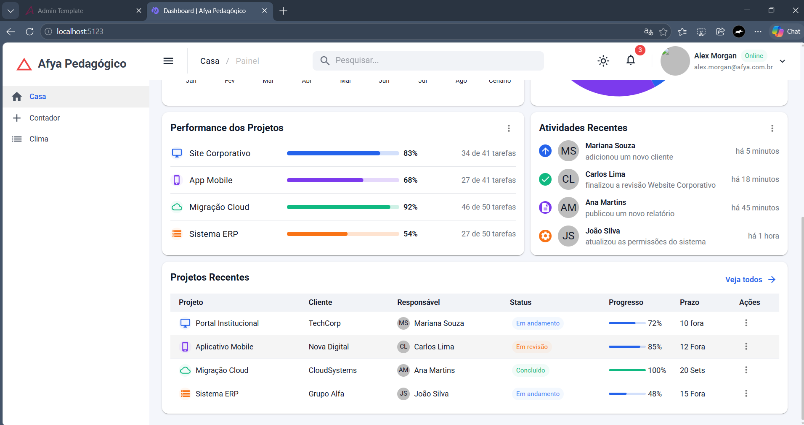

# Afya Admin — Dashboard Pedagógico

## 👨‍🎓 Identificação

**Aluno:** Marcelo  
**Curso:** Ciência da Computação  
**Instituição:** Afya São Lucas  
**Disciplina:** Programação Sistema Web  

---

## 📊 Sobre o projeto

O **Afya Admin** é um dashboard administrativo desenvolvido com **Blazor WebAssembly** e **MudBlazor**.

O objetivo do projeto é construir uma interface administrativa moderna e responsiva para visualização de informações como:

- Indicadores (KPIs);
- Receita e metas;
- Distribuição de clientes;
- Performance dos projetos;
- Atividades recentes;
- Projetos recentes.

Os dados utilizados no projeto são dados demonstrativos, organizados em uma camada de dados para facilitar uma futura substituição por uma API real.

---

## 🛠️ Tecnologias utilizadas

- C#
- .NET 10
- Blazor WebAssembly
- MudBlazor
- HTML
- CSS
- Visual Studio Code
- Git
- GitHub

---

## ▶️ Como executar o projeto

### Pré-requisitos

É necessário possuir:

- .NET SDK 10 instalado;
- Visual Studio Code;
- C# Dev Kit para Visual Studio Code.

### Executando

Clone o repositório:

```bash
git clone https://github.com/celinnkj/afya-admin.git
```
---
## 🖼️ Screenshots

### Dashboard completo


### Performance, atividades e projetos

