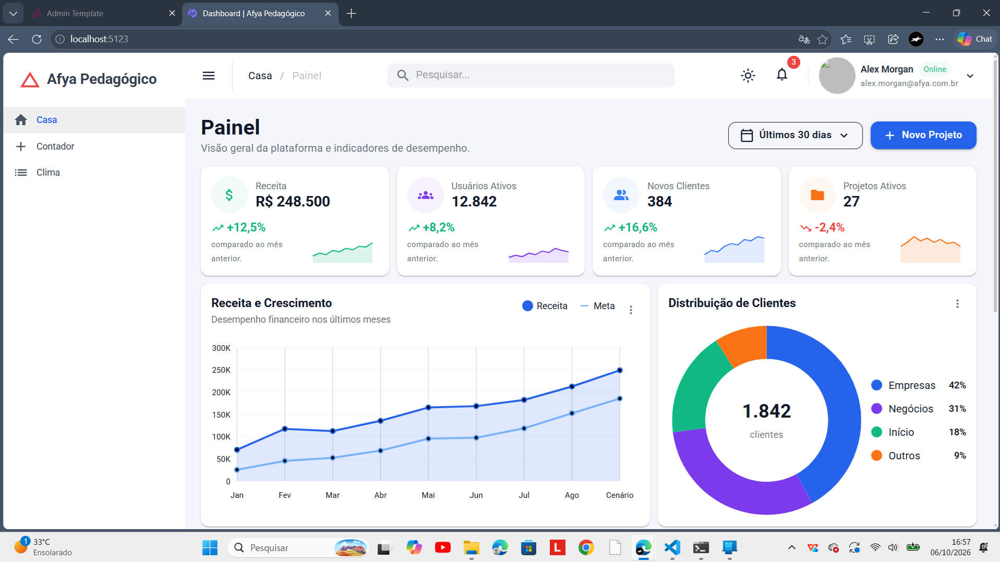
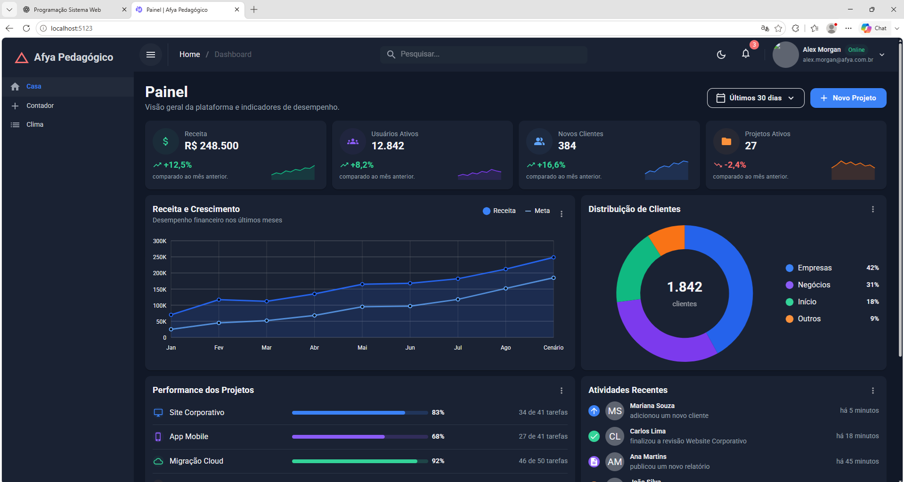
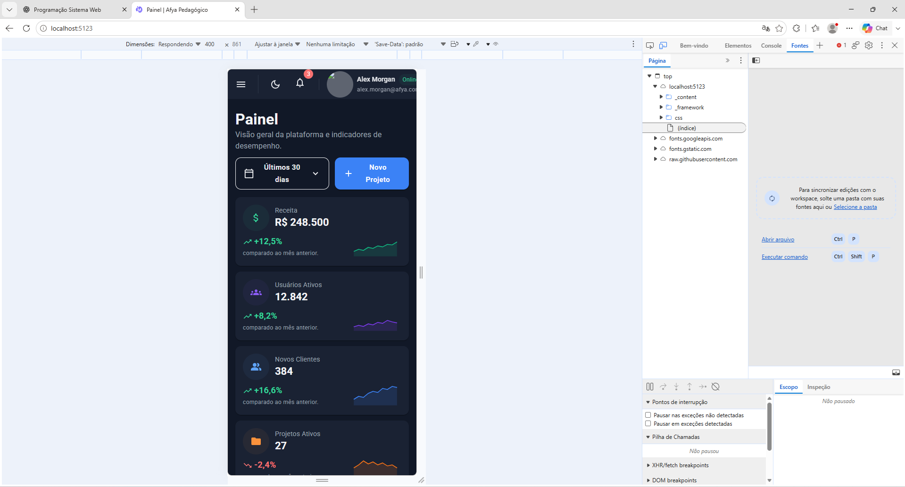
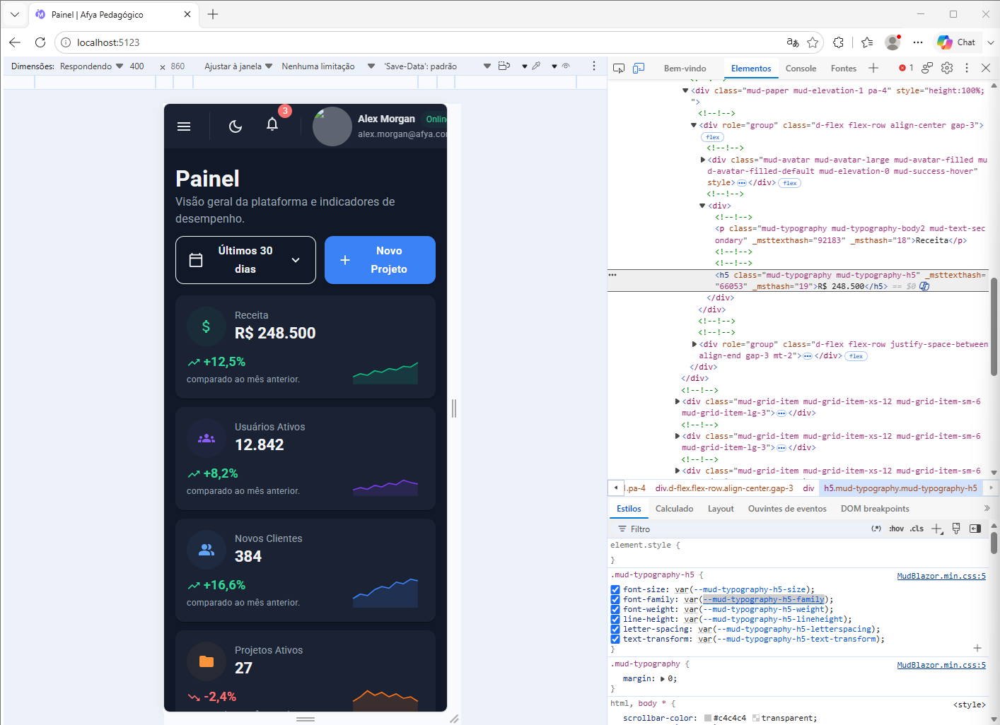

# Afya Pedagógico — Dashboard Administrativo

## Identificação

- **Aluno:** Marcelo Cauã Sales Lima
- **Matrícula:** 2595050
- **Faculdade:** Afya São Lucas
- **Curso:** Ciência da Computação
- **Disciplina:** Programação Sistema Web
- **Professor(a):** Liluyoud Cury De Lacerda
- **Semestre:** 2026.2

## Objetivo

O objetivo deste projeto é desenvolver um dashboard administrativo para a plataforma Afya Pedagógico utilizando Blazor WebAssembly e MudBlazor.

O dashboard apresenta indicadores, gráficos, atividades recentes e projetos recentes utilizando dados fictícios.

## Tecnologias utilizadas

- C#
- .NET 10
- Blazor WebAssembly
- MudBlazor
- HTML
- Git e GitHub
- Visual Studio Code

## Como executar o projeto

Clone o repositório:

```bash
git clone https://github.com/celinnkj/afya-admin.git
```

Entre na pasta do projeto:

```bash
cd afya-admin
```

Execute a aplicação:

```bash
dotnet watch
```

Para verificar se o projeto compila:

```bash
dotnet build
```

## Estrutura do projeto

```text
afya-admin/
├── Components/
├── Data/
├── Layout/
├── Pages/
├── Properties/
├── screenshots/
├── wwwroot/
├── App.razor
├── Program.cs
├── _Imports.razor
└── afya-admin.csproj
```

### Organização das pastas

- **Components:** contém os componentes reutilizáveis utilizados no dashboard.
- **Data:** contém os dados fictícios utilizados pela aplicação.
- **Layout:** contém a estrutura visual principal e o menu lateral.
- **Pages:** contém as páginas da aplicação.
- **screenshots:** contém as capturas de tela utilizadas neste README.
- **wwwroot:** contém os arquivos públicos da aplicação.
- **Program.cs:** configura e inicia a aplicação.
- **App.razor:** contém a estrutura principal de roteamento.
- **_Imports.razor:** reúne os namespaces utilizados pelos componentes.

## Componentes

| Componente | Responsabilidade | Principais parâmetros |
|---|---|---|
| `DashboardCard` | Cria um card reutilizável | `Titulo`, `ChildContent` |
| `KpiCard` | Exibe os indicadores do dashboard | `Kpi` |
| `GraficoReceita` | Exibe o gráfico de receita | Dados de receita e meta |
| `GraficoDistribuicaoClientes` | Exibe a distribuição dos clientes | Segmentos e total |
| `PerformanceProjetos` | Mostra a performance dos projetos | Dados de performance |
| `AtividadesRecentes` | Exibe atividades recentes | Lista de atividades |
| `ProjetosRecentes` | Exibe projetos recentes | Lista de projetos |
| `CabecalhoPagina` | Exibe título e descrição da página | Título, descrição e conteúdo |
| `SeletorPeriodo` | Permite selecionar o período | `Valor` e `ValorChanged` |

## Dados

Os dados utilizados no projeto são fictícios e estão separados dos componentes em `Data/DashboardData.cs`.

Essa organização facilita a manutenção do projeto e permite que, futuramente, os dados sejam substituídos por informações vindas de uma API ou banco de dados.

## Telas

## Tema claro



## Tema escuro



## Visualização mobile



## Inspeção com DevTools



Na imagem do DevTools foi utilizado o recurso **Elements/Elementos** do navegador para inspecionar um dos cards de indicadores do dashboard.

Foi possível observar as tags HTML geradas pelo Blazor e pelo MudBlazor, como `div`, `p` e `h5`, além das classes utilizadas pelos componentes, incluindo classes `mud-*`.

## O que aprendi

### 1. Como uma aplicação Blazor WebAssembly é iniciada?

A aplicação começa pelo `index.html`, que possui o elemento `<div id="app">`. Esse elemento é o ponto onde a aplicação Blazor é carregada.

O `Program.cs` configura os serviços e inicia a aplicação. Depois que o Blazor é carregado no navegador, os componentes são renderizados dentro do elemento `app`.

### 2. Qual a diferença entre Layout, Page e Component?

O **Layout** define uma estrutura compartilhada por várias páginas, como o menu lateral e o cabeçalho.

A **Page** é uma página acessada por uma rota. Um exemplo é `Dashboard.razor`, que possui a rota `/`.

O **Component** é uma parte reutilizável da interface. No projeto existem componentes como `KpiCard`, `GraficoReceita` e `ProjetosRecentes`.

### 3. O que é RenderFragment e como ele é utilizado no DashboardCard?

`RenderFragment` permite passar conteúdo de interface para dentro de um componente.

No `DashboardCard`, ele permite que o componente receba conteúdos diferentes e os coloque dentro do card, tornando o componente reutilizável.

### 4. Como funciona o `@bind-Valor` no SeletorPeriodo?

O `@bind-Valor` cria uma ligação entre o valor selecionado pelo componente e uma variável da página.

O `ValorChanged` comunica ao componente pai que o valor foi alterado.

### 5. Por que os dados ficam separados dos componentes?

Os dados ficam em `Data/DashboardData.cs` para separar as informações da parte visual da aplicação.

Isso facilita a manutenção e permite futuramente substituir os dados fictícios por dados vindos de uma API ou banco de dados.

### 6. Como `xs`, `sm` e `lg` ajudam na responsividade?

Essas propriedades do `MudGrid` definem o espaço ocupado pelos componentes em diferentes tamanhos de tela.

Assim, os cards podem ficar lado a lado em telas maiores e empilhados em telas menores.

### 7. Como o estilo foi feito sem criar CSS personalizado?

Foram utilizados os componentes, classes de utilidade e o `MudTheme` do MudBlazor.

Dessa forma, foi possível configurar a aparência e o espaçamento sem criar uma folha de estilos CSS personalizada.

### 8. Por que o namespace é `afya_admin` e não `afya-admin`?

O hífen `-` não pode ser utilizado normalmente em identificadores de C#. Por isso, o namespace utiliza `_`, ficando `afya_admin`.

## Dificuldades encontradas

### Organização da pasta Data

Durante o desenvolvimento, o arquivo `DashboardData.cs` estava inicialmente dentro de `Layout/Data`. Foi necessário mover o arquivo para uma pasta `Data` própria para deixar a organização do projeto mais adequada.

Depois da mudança, foi executado o `dotnet build` para verificar se o projeto continuava funcionando.

### Configuração e sincronização com Git e GitHub

Outra dificuldade foi configurar o Git e sincronizar o projeto com o GitHub.

Foi necessário configurar o Git, criar o repositório público, adicionar o repositório remoto e realizar commits e `push`.

Depois disso, foi possível clonar o projeto em outro computador e continuar o desenvolvimento sem criar um novo projeto.

## Conclusão

O projeto permitiu praticar o desenvolvimento de uma aplicação web utilizando Blazor WebAssembly e MudBlazor, trabalhando com componentes reutilizáveis, layouts, responsividade, dados fictícios, Git e GitHub.

Também foi possível utilizar o DevTools para observar como os componentes Blazor são transformados em elementos HTML no navegador.